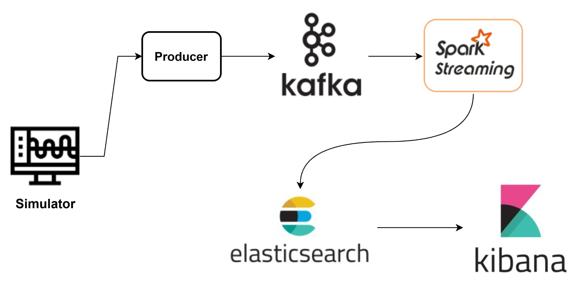
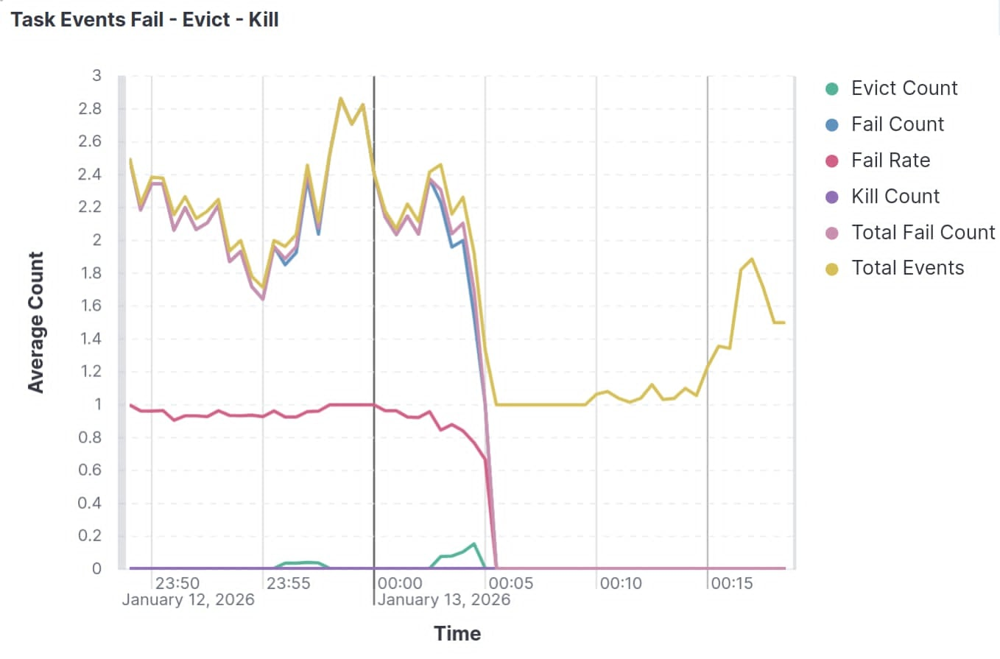

## Real-Time Failure Metrics Analytics with Kafka and Spark Streaming

### 1. Project Overview

This project implements a real-time streaming analytics system for monitoring task failures in a large-scale compute cluster. The system processes task event streams derived from the Google Cluster Data 2011 (task-events) dataset and computes failure-related metrics in near real time.

The main objectives of the system are:

- To ingest high-frequency task events using a distributed message queue

- To perform window-based streaming analytics on task failures

- To store aggregated metrics in a scalable search engine

- To enable real-time monitoring and visualization through dashboards

**Technology Stack**

- Apache Kafka: event ingestion and buffering

- Apache Spark Structured Streaming (PySpark): stream processing and analytics

- Elasticsearch: storage of aggregated metrics

- Kibana: real-time visualization

- Docker & Docker Compose: containerized deployment

- Python: simulation, producer, and Spark streaming logic

### 2. System Architecture

### High-Level Architecture



### Component Roles

**Simulation**

Generates task event streams based on Google cluster trace data. \
Modifications include:

- Replacing original timestamps with the current absolute system time

- Scaling inter-event time gaps from microseconds to milliseconds to support real-time streaming

**Kafka Producer**

Streams simulated task events to Kafka topics in CSV format.

**Kafka & Zookeeper**

Kafka acts as a distributed, fault-tolerant message broker that decouples producers from consumers.
Zookeeper manages broker metadata and coordination.

**Spark Structured Streaming**

Consumes task events from Kafka, applies event-time windowing, and computes failure metrics.

**Elasticsearch**

Stores aggregated metrics as time-series documents for fast querying.

**Kibana**

Provides dashboards for real-time monitoring of failure statistics.

All components are deployed within a Docker bridge network to ensure consistent service discovery and isolation.

### 3. Implementation Details

### 3.1 Docker Compose Configuration

The system is deployed using Docker Compose with the following key configurations:

**Kafka**

Single broker (replicas: 1) for local development

Replication factor set to 1:

```
KAFKA_OFFSETS_TOPIC_REPLICATION_FACTOR=1
KAFKA_TRANSACTION_STATE_LOG_REPLICATION_FACTOR=1
```

Auto topic creation enabled

Custom entrypoint script to remove stale broker IDs from Zookeeper

**Spark Cluster**

One Spark master and Two Spark workers

Each worker:

- 2 CPU cores

- 2 GB memory

**Elasticsearch & Kibana**

Single-node Elasticsearch cluster

Security disabled for local development

Persistent volumes mounted for data storage

### 3.2 Kafka Setup

Topic name: `cluster-metrics`

Data format: CSV (one task event per message)

Bootstrap server: `kafka:29092`

Kafka Entrypoint Logic

The custom Kafka entrypoint:

- Waits for Zookeeper to become available

- Checks for stale broker IDs registered under /brokers/ids

- Removes outdated broker metadata matching the current hostname

- Starts Kafka with dynamically generated broker IDs

This approach avoids broker registration conflicts when restarting containers.

### 3.3 Data Simulation and Producer

Source dataset: Google Cluster Data 2011 – `task-events`

Adjustments:

- Original timestamps replaced with current system time

- Event emission rate scaled to milliseconds

- The producer continuously sends events to Kafka to emulate a live cluster workload.

### 3.4 Spark Structured Streaming Job

Kafka Consumption

Spark reads from Kafka using Structured Streaming:

- Starting offsets: earliest

- Value deserialized as string

- Data Parsing and Cleaning

CSV values are split and cast according to a predefined schema

Timestamp converted from milliseconds to TimestampType

Events with `NULL` `machine_ID` or `job_ID` are filtered out

Window-Based Aggregation

- Event-time window: 2 minutes

- Sliding interval: 30 seconds

- Watermark: 30 seconds

Aggregated metrics per (`machine_ID`, `job_ID`, `window`):

- `total_events`

- `fail_count`

- `evict_count`

- `kill_count`

- `total_fail_count`

- `fail_rate`

Trigger Configuration

- Processing trigger: 1 second

Output mode: update

### 3.5 Output to Elasticsearch

Index pattern: `<task_event_index>_metrics`

Document ID: composite key of window start, machine ID, and job ID

Batch configuration optimized for streaming writes:

- 1000 documents per batch

- 1 MB batch size

This design ensures idempotent updates and efficient ingestion.

4. Results

The system successfully processes streaming task events in near real time:

- Kafka buffers incoming data reliably

- Spark computes failure metrics using sliding windows

- Elasticsearch stores aggregated metrics as time-series data

Kibana visualizes:

- Failure counts over time

- Failure rate per machine and job



The architecture demonstrates a complete real-time analytics pipeline suitable for cluster monitoring.

### 5. Challenges and Lessons Learned

Reduced the rate of generating data because of limitations in resources

Kafka broker state management in containerized environments requires careful handling of Zookeeper metadata.

Choosing appropriate window size and watermark is critical to balancing latency and accuracy.

Structured Streaming simplifies streaming analytics but requires a clear understanding of event-time processing semantics.
